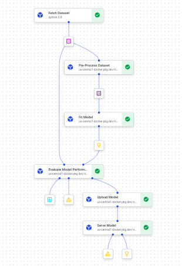

# House_Hold_Appliances Outliers Detection

## Overview
As a pillar, we've decided to adopt [Kubeflow](https://www.kubeflow.org/docs/started/introduction/)
as our primary solution for MLOps in our model build pipelines. Kubeflow is an OSS project designed to make deployments 
of ML workflows on Kubernetes simple, portable, and scalable.
[Kubeflow Pipelines](https://www.kubeflow.org/docs/components/pipelines/introduction/) is the orchestration solution 
within Kubeflow. It provides a scheduling engine for DAG-based workflows, a UI for managing and tracking
pipeline runs, and an SDK for defining and manipulating pipelines and their components.
Once defined, pipelines are run on a Kubernetes cluster running the Kubeflow management
services. We've adopted [Vertex AI Pipelines](https://cloud.google.com/vertex-ai/docs/pipelines/introduction)
as a managed solution for such clusters.

## Some Basic Terminology

1. Component -- reusable task definition; defined by 3 things:
   1. Docker image
   2. Code that runs in the Docker image
   3. I/O contract
2. Step -- an instance of a component in a pipeline
3. Pipeline -- a combination of steps that makes up a DAG
   1. Also includes things like resource limit requests and other Kubernetes configuration
4. Run -- an execution of a particular pipeline


## Resources
- Setup [document](https://kronos.sharepoint.com/:w:/t/aipillar/Eeaps7nSEG9Dj-ak4Y8K094BjHdqoti-BWsFjUNuxUbZLQ?e=krhnEK).
- Lightweight [components](https://www.kubeflow.org/docs/components/pipelines/v2/components/lightweight-python-components/).
- Containerized Python [components](https://www.kubeflow.org/docs/components/pipelines/v2/components/containerized-python-components/).
- Container [data types](https://www.kubeflow.org/docs/components/pipelines/v2/data-types/parameters/).
- Kubeflow [CLI](https://kubeflow-pipelines.readthedocs.io/en/master/source/cli.html#kfp-component-build).
- Machine Type [Specifications](https://cloud.google.com/vertex-ai/docs/pipelines/machine-types).
- General Purpose [Machines](https://cloud.google.com/compute/docs/general-purpose-machines).

## The Modeling Task

This job is to identify the numbers of outliers present in dataset named: "household_power_consumption",
[originally from the UCI ML repository](https://archive.ics.uci.edu/dataset/235/individual+household+electric+power+consumption).

Details:

1. Target is to predict outliers (appliances consuming more electricity) from the dataset.
2. Contains 9 data features; [detailed descriptions here](https://cseweb.ucsd.edu/classes/sp15/cse190-c/reports/sp15/048.pdf)
3. Data present in this is un-labeled, we are performing clustering over this data to detect number of outliers.

## Kubeflow DAG


## Pipeline Configuration
Below is the pipeline definition. We will add tasks which are instances of components to this pipeline. In order identify which pipeline is submitted by you please change pipeline name by appending your name.

```python
"""
PIPELINE_NAME = "dbscan-cluster-kubeflow"
PIPELINE_DESCRIPTION = "Kubeflow pipeline tutorial."
PIPELINE_JSON = './dbscan_pipeline.json'
PIPELINE_ROOT_GCS = "gs://nashtech-ai-dev-389315-kubeflow-tutorial-pipeline"

@kfp.dsl.pipeline(name=PIPELINE_NAME,
                  description=PIPELINE_DESCRIPTION,
                  pipeline_root=PIPELINE_ROOT_GCS)
def pipeline(
        project_id: str,
        job_id: str
):
"""
```

## Component Development

### First component (Process Data)
Read data from GCS Bucket and save it as a parquet fil. Use lightweight components.

**Component annotation parameters:**
- Specify Python version, 3.10.6
- Packages to install.

**Function Parameters:**
- Project id.
- Output artifact. Use Kubeflow `dsl.Output` with the `dsl.Dataset` artifact type so that Kubeflow can provide the path where we can save the processed dataframe.

#### Component Definition
```python
@component(
    base_image="python:3.10.6",
    packages_to_install=resolve_dependencies(
        'pandas',
        'numpy',
        'google-cloud-storage',
        'gcsfs',
        'pyarrow',
        'fsspec'
    )
)
def process_data(dataset: dsl.Output[dsl.Dataset]):
```

#### Adding component to the pipeline.
```python
# Download data from GCS; path of GCS output is returned.
process_data_task = process_data().set_display_name("Process Data")
```


### Second component (Train Model)
This component will train a models based on the selector parameter passed in. This will be a custom 
built component with Base and Target images specified. Use the line below to build the component, if you want to
push the image to the Google Cloud Registry remove the `--no-push-image` flag.

```shell
kfp components build components/ --component-filepattern train.py --no-push-image
```

**Parameters:**
- Batch size: Size of batch from data used to train the model
- Path to the data which is processed and saved in the first component. Use Kubeflow `dsl.Input` with the `dsl.Dataset` artifact type. The value will be passed in from the pipeline code linking the output of the first component to this input artifact.
- Artifact output path. Use Kubeflow `dsl.Output` with the `dsl.Model`Output artifact type so that Kubeflow can provide the path where we can save the trained model artifact.
- Model name: Depending on the model name given.

**Component annotation parameters:**
- Base image: This is the image we created and uploaded to the Google Image Registry. This image has all the dependencies and training code.

```python
"""
PROJECT_ID = "nashtech-ai-dev-389315"
BASE_IMAGE_QUALIFIER = "db-scan-image"
BASE_IMAGE_TAG = "0.0.1"
BASE_IMAGE = f"gcr.io/{PROJECT_ID}/{BASE_IMAGE_QUALIFIER}:{BASE_IMAGE_TAG}"
"""
```

#### Component Definition
```python
@component(
    base_image=BASE_IMAGE,
    packages_to_install=resolve_dependencies(
        'pandas',
        'kfp',
        'numpy',
        'scikit-learn',
        'fsspec',
        'pyarrow',
        'gcsfs',
        'scikit-learn',
        'google-cloud-storage',
    )
)
def fit_model(
        batch_size: int,
        dataset_path: dsl.Input[dsl.Dataset],
        model_artifact_path: dsl.Output[dsl.Model],
        model_name: str = 'db_scan',
):

```

#### Adding component to the pipeline.
We will create an instance of the component of db_scan model name.

```python
# Fit model pipeline
fit_model_task = fit_model(BATCH_SIZE, process_data_task.output) \
  .after(process_data_task) \
  .set_display_name("Fit DB_Scan Model") \
  .set_cpu_request("4") \
  .set_memory_limit("16G")
```

### Third component (Evaluate Model)

Calculate Scores and Form Image then . Use lightweight components.

Component annotation parameters:
- Specify Base Image
- Packages to install.

Function Parameters:
- Batch Size: Batch size use to evaluate model performance
- Bucket Name: Use to save the image to GCS Bucket.
- Dataset Path: Dataset Parquet file path given as output from First Component (Process Data).
- Model Path: Trained Model Path Stored over artifact registry.
- Average Score: Calculated average silhouette score given as output.
- Cluster Image: Cluster Image Path saved over GCS Bucket.
- Image Path: Local Image Path to be saved locally then used to upload to GCS Bucket.

#### Component Definition
```python
@component(
    base_image=BASE_IMAGE,
    packages_to_install=resolve_dependencies(
        'pandas',
        'fsspec',
        'google-cloud-storage',
        'gcsfs',
        'pyarrow',
        'matplotlib',
        'numpy',
        'scikit-learn'
    )
)
def evaluate_model(batch_size: int,
                   bucket_name: str,
                   dataset_path: dsl.Input[dsl.Dataset],
                   model_path: dsl.Input[dsl.Model],
                   avg_score: dsl.Output[dsl.Metrics],
                   cluster_image: dsl.Output[dsl.Artifact],
                   image_path: str = "cluster_image.png"
                   ):
```

#### Adding component to the pipeline.
```python
# Evaluate model component
    model_evaluation_task = evaluate_model(BATCH_SIZE, CLUSTER_IMAGE_BUCKET,
                                           process_data_task.output, fit_model_task.output) \
        .set_display_name("Model_Validation")
```
   

### Fourth component (Upload Model)

Create Serving Container Image and Push to Artifact Registry. Use lightweight components.

Component annotation parameters:
- Specify Base Image
- Packages to install.

Function Parameters:
- Project ID: Unique Project ID used to upload serving model image to artifact registry.
- Trigger ID: Cloud Build Trigger ID used to trigger the cloud build of serving container image creation and push to artifact registry
- 
#### Component Definition
```python
@component(
    base_image=BASE_IMAGE,
    packages_to_install=resolve_dependencies(
        'google-cloud-build'
    )
)
def upload_container(project_id: str,
                     trigger_id: str,
                     ):
```

#### Adding component to the pipeline.
```python
# Upload Model to Artifact Registry Component
    upload_model_task = upload_container(project_id, TRIGGER_ID)\
        .after(model_evaluation_task)\
        .set_display_name("Model_Upload")
```


### Fifth component (Serve Model)

Serve Model to an endpoint for both batch and online prediction. Use lightweight components.

Component annotation parameters:
- Specify Base Image
- Packages to install.

Function Parameters:
- Project ID: Unique Project ID used to upload model to model registry
- Trigger ID: Cloud Build Trigger ID used to trigger the cloud build of serving container image creation and push to artifact registry
- 
#### Component Definition
```python
@component(
    base_image=BASE_IMAGE,
    packages_to_install=resolve_dependencies(
        'google-cloud-aiplatform'
    )
)
def serve_model_component(
        project_id: str,
        location: str,
        staging_bucket: str,
        serving_image_uri: str,
        model_display_name: str,
        vertex_endpoint: Output[Artifact],
        vertex_model: Output[Model],
        machine_type: str = 'e2-standard-2',

):
```

#### Adding component to the pipeline.
```python
# Serve Model To Endpoint
serve_model_task = serve_model_component(project_id, REGION, STAGING_BUCKET, SERVING_IMAGE, MODEL_DISPLAY_NAME) \
        .after(upload_model_task) \
        .set_display_name("Serve_Model")
```

## Execute Pipeline Run:

For this project we create a cloud build trigger over GCP:

### Note: You can create your own cloud build trigger and define the path of your "cloudbuild.yaml" file by linking you source repository,

- In this case we use used # Github # for our source code repository.
- Define the location of cloudbuild.yaml file located in your repository in cloud build trigger.
- Set Invocation to run on push.
- Approve build run when ever the new push to repo is created (If Build is Required).

### See Status of Cloud Build in History over Cloud Build Page on GCP.